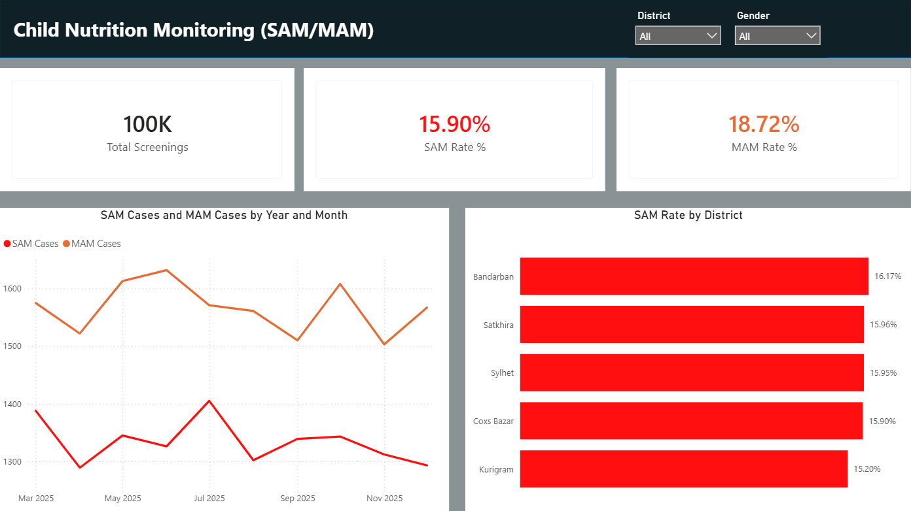

# 🌍 Child Nutrition Monitoring Data Pipeline

## 📌 Executive Summary
International NGOs and public health organizations operating field clinics often struggle with fragmented data collection. When clinical growth metrics (Weight, Height, MUAC) are siloed in isolated spreadsheets, reporting to donors becomes a slow, error-prone manual process. 

This project demonstrates an **automated, end-to-end ELT data pipeline** and **interactive dashboard** designed to transform raw field data into actionable insights for Monitoring & Evaluation (M&E), research analysis, and donor transparency.

---

## 💼 Business Development & Research Value
* **Grant Acquisition & Donor Reporting:** Automates the reporting of key performance indicators (KPIs) like SAM (Severe Acute Malnutrition) and MAM (Moderate Acute Malnutrition) rates, providing the real-time transparency that international donors require.
* **Research Data Integrity:** Utilizes strict SQL constraints and staging tables to sanitize inconsistent regional date formats (`dd/MM/yyyy` to `YYYY-MM-DD`) and eliminate duplicate entries from field workers.
* **Resource Allocation:** Empowers program managers to geographically pinpoint malnutrition spikes (e.g., in Cox's Bazar or Sylhet) to efficiently deploy emergency therapeutic food supplies.

---

## 🛠️ Technical Stack
* **Database & Data Modeling:** Microsoft SQL Server (T-SQL)
* **Data Engineering (ELT):** Bulk Insert, Staging Tables, Data Type Casting (`TRY_CONVERT`), Foreign Key Constraints
* **Synthetic Data Generation:** Python (`pandas`, `numpy`) — *Simulated 100,000+ realistic clinical screening records based on WHO MUAC standards.*
* **Business Intelligence:** Power BI (Relational Star Schema modeling, DAX, Interactive visual cross-filtering)

---

## 📊 Dashboard Preview
*(Note: To make this image appear, upload your dashboard screenshot to the repo as `dashboard_preview.png`)*

---

## ⚙️ Methodology & Project Lifecycle

### 1. Database Architecture (Star Schema)
Designed a scalable relational model separating dimensional lookups from massive clinical events to ensure Power BI query efficiency.
* `Dim_Clinic`: Geolocation and facility data.
* `Dim_Child`: Demographic tracking (Gender, Age cohorting).
* `Fact_Screenings`: 100,000+ daily clinical metrics (MUAC, Weight, Malnutrition Status).

### 2. The ELT Pipeline (Extract, Load, Transform)
Field data is inherently messy. I engineered a robust SQL pipeline to handle common data anomalies:
* Utilized `#Stage` tables to safely ingest raw CSVs without crashing the database.
* Implemented `COALESCE` and `TRY_CAST` logic to standardize mixed date formats and strip hidden carriage returns generated by legacy operating systems.

### 3. Analytics & Views
Created pre-aggregated SQL Views for instant BI ingestion, including temporal trends (Month-over-Month SAM rates) and demographic vulnerability heatmaps.

---
*Created by Md Maniruzzaman — Open to freelance opportunities in Data Analytics for the Humanitarian & Development sector.*
